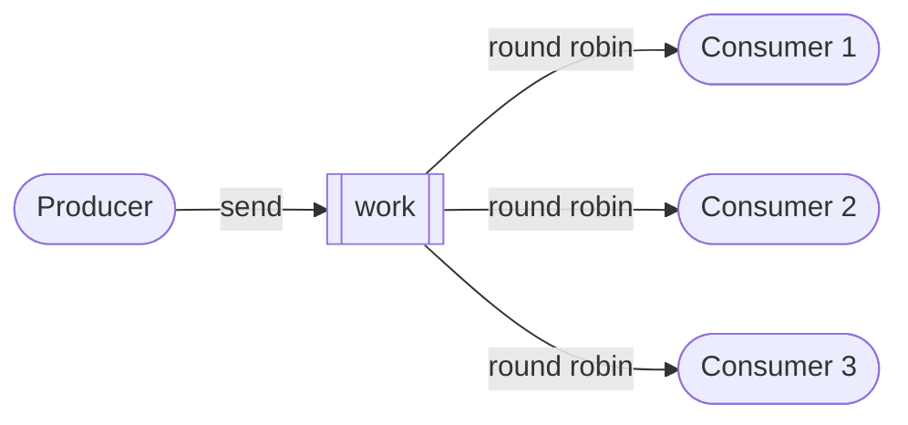
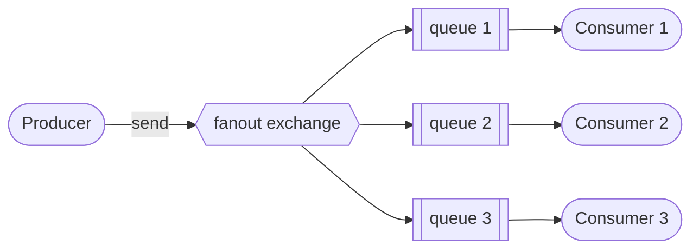
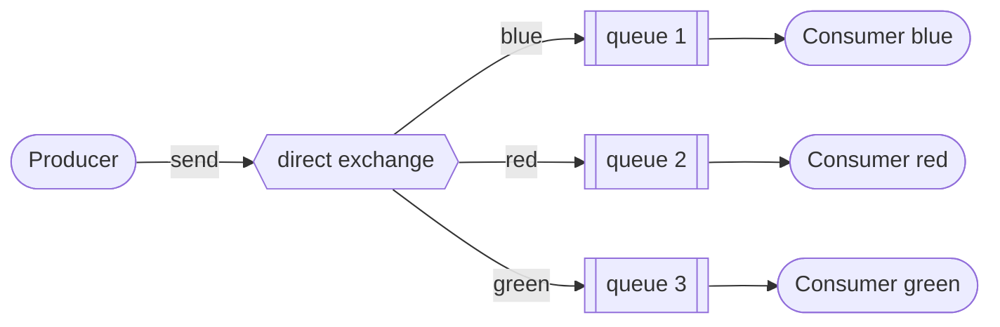
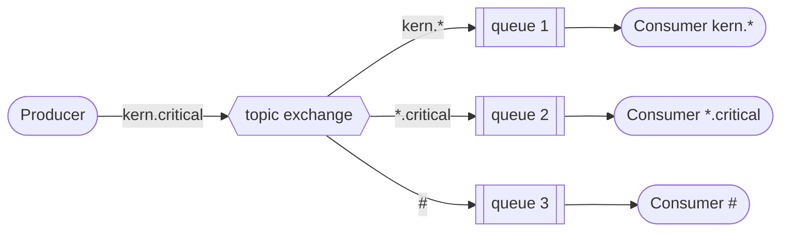
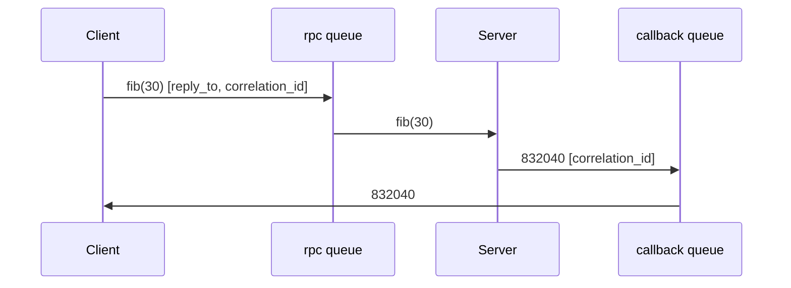

# Example Messaging Patterns

Here are some straightforward, example-based tutorials for building basic
messaging applications using [RabbitMQ](https://www.rabbitmq.com/download.html).
To run the code examples, make sure both RabbitMQ and the
[Pika](https://github.com/pika/pika/) Python library are installed.
The examples require Python 3 and Pika 1.x.

## Installation

* Install [RabbitMQ](https://www.rabbitmq.com/download.html) (or run it with
  Docker: `docker run -d --name rabbitmq -p 5672:5672 rabbitmq:3`)
* Install [Pika](https://github.com/pika/pika/):

```bash
pip install -r requirements.txt
```

## Basic Pattern

This is a basic pattern for sending messages using RabbitMQ as the broker. The
example consists of three components: the **Producer**, **Queue**, and
**Consumer**. The producer creates and sends messages to the queue, which
resides on the RabbitMQ server. The consumer then retrieves and processes
these messages from the queue.


### Producer

A producer is the application that sends the messages. Imagine sending text
messages to your friend.

```python
#!/usr/bin/env python3
from datetime import datetime
from queues import Queue

class Producer(Queue):
    def __init__(self):
        Queue.__init__(self, queue='basic')

if __name__ == '__main__':
    NOW = datetime.now()
    p = Producer()
    for i in range(5):
        p.send(f'{i} {NOW} - Basic - Hello World')
        print(f'{i} {NOW} - Basic - Hello World sent')
    p.close()
```

```console
rangertaha@coder:~/messaging-patterns/basic$ python producer.py
0 2014-04-22 00:19:59.497745 - Basic - Hello World sent
1 2014-04-22 00:19:59.497745 - Basic - Hello World sent
2 2014-04-22 00:19:59.497745 - Basic - Hello World sent
3 2014-04-22 00:19:59.497745 - Basic - Hello World sent
4 2014-04-22 00:19:59.497745 - Basic - Hello World sent
```

Use the **rabbitmqctl** command line admin tool to list the queues.

```console
rangertaha@coder:~/messaging-patterns/basic$ sudo rabbitmqctl list_queues
Listing queues ...
basic	5
...done.
```

### Consumer

A consumer is the application that receives the messages. Imagine your friend
who is receiving your text messages.

```python
#!/usr/bin/env python3
from queues import Queue

class Consumer(Queue):
    def __init__(self):
        Queue.__init__(self, queue='basic')

    def callback(self, ch, method, properties, body):
        print(f'{body.decode()} received')

if __name__ == '__main__':
    p = Consumer()
    p.receive()
```

The following is the execution and output of the consumer.py script.

```console
rangertaha@coder:~/messaging-patterns/basic$ python consumer.py
0 2014-04-22 00:19:59.497745 - Basic - Hello World received
1 2014-04-22 00:19:59.497745 - Basic - Hello World received
2 2014-04-22 00:19:59.497745 - Basic - Hello World received
3 2014-04-22 00:19:59.497745 - Basic - Hello World received
4 2014-04-22 00:19:59.497745 - Basic - Hello World received
```

### Queue

The Queue in this setup is the RabbitMQ server, which communicates using the
AMQP protocol. It receives and stores messages, allowing the consumer to pick
them up whenever it's ready. Think of it like texting a friend whose phone is
off—your messages are held in the Queue until your friend turns their phone
back on and receives them.

```python
#!/usr/bin/env python3
import pika

class Queue:
    def __init__(self, queue='queue', host='localhost'):
        self.connection = pika.BlockingConnection(
            pika.ConnectionParameters(host=host))
        self.channel = self.connection.channel()
        self.channel.queue_declare(queue=queue)
        self.queue = queue

    def send(self, msg):
        self.channel.basic_publish(exchange='',
                                   routing_key=self.queue,
                                   body=msg)

    def receive(self):
        self.channel.basic_consume(queue=self.queue,
                                   on_message_callback=self.callback,
                                   auto_ack=True)
        self.channel.start_consuming()

    def close(self):
        self.connection.close()
```

## Worker

This example demonstrates a work queue, designed to distribute messages across
multiple workers. It is the next simplest pattern after a basic messaging
setup. Like before, this pattern has three components: the **Producer**,
**Queue**, and **Consumers**. The producer creates and sends messages to the
queue, which resides on the RabbitMQ server. Multiple consumers can connect to
the queue, with messages distributed evenly among them. You can add as many
consumers as needed to share the workload.

The queue is declared **durable** and messages are published as persistent, so
pending work survives a broker restart. Each worker acknowledges a message
only after processing it, and `prefetch_count=1` ensures a busy worker isn't
handed more work while others are idle.



### Producer

This producer functions just like in the previous basic example. It's the
application responsible for sending messages.

```python
#!/usr/bin/env python3
from datetime import datetime
from queues import Queue

class Producer(Queue):
    def __init__(self):
        Queue.__init__(self, queue='work')

if __name__ == '__main__':
    NOW = datetime.now()
    p = Producer()
    for i in range(15):
        p.send(f'{i} {NOW} - Work - Hello World')
        print(f'{i} {NOW} - Work - Hello World sent')
    p.close()
```

```console
~/messaging-patterns/workers$ python producer.py
0 2014-04-22 00:10:16.946810 - Work - Hello World sent
1 2014-04-22 00:10:16.946810 - Work - Hello World sent
2 2014-04-22 00:10:16.946810 - Work - Hello World sent
3 2014-04-22 00:10:16.946810 - Work - Hello World sent
4 2014-04-22 00:10:16.946810 - Work - Hello World sent
5 2014-04-22 00:10:16.946810 - Work - Hello World sent
6 2014-04-22 00:10:16.946810 - Work - Hello World sent
7 2014-04-22 00:10:16.946810 - Work - Hello World sent
8 2014-04-22 00:10:16.946810 - Work - Hello World sent
9 2014-04-22 00:10:16.946810 - Work - Hello World sent
10 2014-04-22 00:10:16.946810 - Work - Hello World sent
11 2014-04-22 00:10:16.946810 - Work - Hello World sent
12 2014-04-22 00:10:16.946810 - Work - Hello World sent
13 2014-04-22 00:10:16.946810 - Work - Hello World sent
14 2014-04-22 00:10:16.946810 - Work - Hello World sent
```

Use the **rabbitmqctl** command line admin tool to list the queues.

```console
rangertaha@coder:~/messaging-patterns/workers$ sudo rabbitmqctl list_queues
Listing queues ...
work	15
...done.
```

### Consumers

A consumer is the application that receives messages. This consumer retrieves
a message, prints it to the terminal, waits for 1 second, acknowledges the
message, and then repeats the process.

```python
#!/usr/bin/env python3
import time
from queues import Queue

class Consumer(Queue):
    def __init__(self):
        Queue.__init__(self, queue='work')

    def callback(self, ch, method, properties, body):
        print(f'{body.decode()} received')
        time.sleep(1)
        ch.basic_ack(delivery_tag=method.delivery_tag)

if __name__ == '__main__':
    p = Consumer()
    p.receive()
```

Here, I'm running three separate instances of **consumer.py** in different
terminal windows. Notice that the numbers at the beginning of each line are
unique—each consumer receives a different message from the set sent by the
producer. Each consumer processes one message, waits for one second, and then
repeats the process.

```console
rangertaha@coder:~/messaging-patterns/workers$ python consumer.py
0 2014-04-22 00:10:16.946810 - Work - Hello World received
3 2014-04-22 00:10:16.946810 - Work - Hello World received
6 2014-04-22 00:10:16.946810 - Work - Hello World received
9 2014-04-22 00:10:16.946810 - Work - Hello World received
12 2014-04-22 00:10:16.946810 - Work - Hello World received
```

```console
rangertaha@coder:~/messaging-patterns/workers$ python consumer.py
1 2014-04-22 00:10:16.946810 - Work - Hello World received
4 2014-04-22 00:10:16.946810 - Work - Hello World received
7 2014-04-22 00:10:16.946810 - Work - Hello World received
10 2014-04-22 00:10:16.946810 - Work - Hello World received
13 2014-04-22 00:10:16.946810 - Work - Hello World received
```

```console
rangertaha@coder:~/messaging-patterns/workers$ python consumer.py
2 2014-04-22 00:10:16.946810 - Work - Hello World received
5 2014-04-22 00:10:16.946810 - Work - Hello World received
8 2014-04-22 00:10:16.946810 - Work - Hello World received
11 2014-04-22 00:10:16.946810 - Work - Hello World received
14 2014-04-22 00:10:16.946810 - Work - Hello World received
```

### Queue

The Queue in this setup is the RabbitMQ server, which communicates using the
AMQP protocol. It receives and stores messages, allowing the consumer to
retrieve them when ready.

```python
#!/usr/bin/env python3
import pika

class Queue:
    def __init__(self, queue='work', host='localhost'):
        self.connection = pika.BlockingConnection(
            pika.ConnectionParameters(host=host))
        self.channel = self.connection.channel()
        self.channel.queue_declare(queue=queue, durable=True)
        self.queue = queue

    def send(self, msg):
        self.channel.basic_publish(
            exchange='',
            routing_key=self.queue,
            body=msg,
            properties=pika.BasicProperties(
                delivery_mode=pika.DeliveryMode.Persistent))

    def receive(self):
        self.channel.basic_qos(prefetch_count=1)
        self.channel.basic_consume(queue=self.queue,
                                   on_message_callback=self.callback)
        self.channel.start_consuming()

    def close(self):
        self.connection.close()
```

## Publish/Subscribe

The publish/subscribe pattern enables a message to be delivered to multiple
consumers, unlike the worker pattern. Here, the producer sends messages
directly to an exchange, which then applies its rules to distribute the
messages to multiple consumers.



### Producer

The producer sends messages to the exchange. Same as in the basic example.

```python
#!/usr/bin/env python3
from datetime import datetime
from exchange import Exchange

class Producer(Exchange):
    def __init__(self):
        Exchange.__init__(self, exchange='exchange-001',
                          exchange_type='fanout')

    def send(self, msg):
        self.channel.basic_publish(exchange=self.exchange,
                                   routing_key='', body=msg)

if __name__ == '__main__':
    NOW = datetime.now()
    p = Producer()
    for i in range(5):
        p.send(f'{i} {NOW} - Pub/Sub - Hello World')
        print(f'{i} {NOW} - Pub/Sub - Hello World sent')
    p.close()
```

```console
rangertaha@coder:~/messaging-patterns/pubsub$ python producer.py
0 2014-04-22 09:39:16.483488 - Pub/Sub - Hello World sent
1 2014-04-22 09:39:16.483488 - Pub/Sub - Hello World sent
2 2014-04-22 09:39:16.483488 - Pub/Sub - Hello World sent
3 2014-04-22 09:39:16.483488 - Pub/Sub - Hello World sent
4 2014-04-22 09:39:16.483488 - Pub/Sub - Hello World sent
```

### Exchange

The producer doesn't send messages directly to a queue; instead, it sends them
to an exchange. The exchange receives messages from producers and decides how
to route them—either by delivering them to one or more queues or by discarding
them. This routing behavior depends on the type of exchange. The available
exchange types are: **direct**, **topic**, **headers** and **fanout**.

```console
rangertaha@coder:~/messaging-patterns/pubsub$ sudo rabbitmqctl list_exchanges
Listing exchanges ...
	direct
amq.direct	direct
amq.fanout	fanout
amq.headers	headers
amq.match	headers
amq.rabbitmq.log	topic
amq.rabbitmq.trace	topic
amq.topic	topic
...done.
```

In terms of learning and clarification, I am representing the exchange as a
class.

```python
#!/usr/bin/env python3
from queues import Queue

class Exchange(Queue):
    def __init__(self, exchange='exchange-001', exchange_type='fanout'):
        Queue.__init__(self)
        self.channel.exchange_declare(exchange=exchange,
                                      exchange_type=exchange_type)
        self.exchange = exchange
        self.exchange_type = exchange_type
```

### Consumers

Each consumer declares its own exclusive queue and binds it to the exchange,
so every consumer receives a copy of every message.

```python
#!/usr/bin/env python3
from exchange import Exchange

class Consumer(Exchange):
    def __init__(self):
        Exchange.__init__(self, exchange='exchange-001',
                          exchange_type='fanout')
        self.bind()

    def bind(self):
        result = self.channel.queue_declare(queue='', exclusive=True)
        self.channel.queue_bind(exchange=self.exchange,
                                queue=result.method.queue)
        self.queue = result.method.queue

    def callback(self, ch, method, properties, body):
        print(f'{body.decode()} received')

if __name__ == '__main__':
    p = Consumer()
    p.receive()
```

Here, I'm running three separate instances of **consumer.py** in different
terminals. Notice that every consumer receives a copy of every message sent by
the producer.

```console
rangertaha@coder:~/messaging-patterns/pubsub$ python consumer.py
0 2014-04-22 09:39:16.483488 - Pub/Sub - Hello World received
1 2014-04-22 09:39:16.483488 - Pub/Sub - Hello World received
2 2014-04-22 09:39:16.483488 - Pub/Sub - Hello World received
3 2014-04-22 09:39:16.483488 - Pub/Sub - Hello World received
4 2014-04-22 09:39:16.483488 - Pub/Sub - Hello World received
```

```console
rangertaha@coder:~/messaging-patterns/pubsub$ python consumer.py
0 2014-04-22 09:39:16.483488 - Pub/Sub - Hello World received
1 2014-04-22 09:39:16.483488 - Pub/Sub - Hello World received
2 2014-04-22 09:39:16.483488 - Pub/Sub - Hello World received
3 2014-04-22 09:39:16.483488 - Pub/Sub - Hello World received
4 2014-04-22 09:39:16.483488 - Pub/Sub - Hello World received
```

### Queue

The Queue is the RabbitMQ server, which uses AMQP for communication. It
receives and stores messages, allowing the consumer to retrieve them when
ready. In this pattern each consumer binds its own exclusive queue to the
exchange, so the base class no longer declares a named queue.

```python
#!/usr/bin/env python3
import pika

class Queue:
    def __init__(self, queue='', host='localhost'):
        self.connection = pika.BlockingConnection(
            pika.ConnectionParameters(host=host))
        self.channel = self.connection.channel()
        self.queue = queue

    def receive(self):
        self.channel.basic_consume(queue=self.queue,
                                   on_message_callback=self.callback,
                                   auto_ack=True)
        self.channel.start_consuming()

    def close(self):
        self.connection.close()
```

## Routing

This routing pattern uses the **direct** exchange type along with a
**routing_key**. Consumers use this key to access the messages from the queue.



### Producer

The producer sends messages to the exchange, which in this case is of the
**direct** type. The producer also accepts an argument that is used as the
**routing_key**.

```python
#!/usr/bin/env python3
import sys
from datetime import datetime
from exchange import Exchange

class Producer(Exchange):
    def __init__(self, routing):
        Exchange.__init__(self, exchange='exchange_001',
                          exchange_type='direct')
        self.routing = routing

    def send(self, msg):
        self.channel.basic_publish(exchange=self.exchange,
                                   routing_key=self.routing,
                                   body=msg)

if __name__ == '__main__':
    NOW = datetime.now()
    p = Producer(sys.argv[1])
    for i in range(5):
        p.send(f'{i} {NOW} - Routing - {p.routing}')
        print(f'{i} {NOW} - Routing - {p.routing} sent')
    p.close()
```

Below, you can see that I ran the producer with **blue**, **red**, and then
**green** as a single argument. This argument is used as the **routing_key**,
which consumers will need to retrieve the corresponding message.

```console
rangertaha@coder:~/messaging-patterns/routing$ python producer.py blue
0 2014-04-22 12:08:08.657679 - Routing - blue sent
1 2014-04-22 12:08:08.657679 - Routing - blue sent
2 2014-04-22 12:08:08.657679 - Routing - blue sent
3 2014-04-22 12:08:08.657679 - Routing - blue sent
4 2014-04-22 12:08:08.657679 - Routing - blue sent
rangertaha@coder:~/messaging-patterns/routing$ python producer.py red
0 2014-04-22 12:08:12.715046 - Routing - red sent
1 2014-04-22 12:08:12.715046 - Routing - red sent
2 2014-04-22 12:08:12.715046 - Routing - red sent
3 2014-04-22 12:08:12.715046 - Routing - red sent
4 2014-04-22 12:08:12.715046 - Routing - red sent
rangertaha@coder:~/messaging-patterns/routing$ python producer.py green
0 2014-04-22 12:08:19.934197 - Routing - green sent
1 2014-04-22 12:08:19.934197 - Routing - green sent
2 2014-04-22 12:08:19.934197 - Routing - green sent
3 2014-04-22 12:08:19.934197 - Routing - green sent
4 2014-04-22 12:08:19.934197 - Routing - green sent
```

### Exchange

The exchange receives messages from the producer and routes them to queues. It
determines how to handle each message, with options to send it to a single
queue, multiple queues, or discard it entirely. The routing decision depends
on the type of exchange.

This example uses the **direct** exchange type. For clarity, I am representing
the exchange as a class.

```python
#!/usr/bin/env python3
from queues import Queue

class Exchange(Queue):
    def __init__(self, exchange='exchange_001', exchange_type='direct'):
        Queue.__init__(self)
        self.channel.exchange_declare(exchange=exchange,
                                      exchange_type=exchange_type)
        self.exchange = exchange
        self.exchange_type = exchange_type
```

### Consumers

A consumer is the application that receives messages. This consumer accepts
one argument, which is used as the **routing_key**. It then prints all
messages with that **routing_key** to the terminal.

```python
#!/usr/bin/env python3
import sys
from exchange import Exchange

class Consumer(Exchange):
    def __init__(self, routing):
        Exchange.__init__(self, exchange='exchange_001',
                          exchange_type='direct')
        self.routing = routing
        self.bind()

    def bind(self):
        result = self.channel.queue_declare(queue='', exclusive=True)
        self.channel.queue_bind(exchange=self.exchange,
                                queue=result.method.queue,
                                routing_key=self.routing)
        self.queue = result.method.queue

    def callback(self, ch, method, properties, body):
        print(f'{body.decode()} received')

if __name__ == '__main__':
    p = Consumer(sys.argv[1])
    p.receive()
```

In these examples, the consumer is provided with an argument that serves as
the **routing_key**. It then retrieves the messages associated with that
**routing_key**.

```console
rangertaha@coder:~/messaging-patterns/routing$ python consumer.py blue
0 2014-04-22 12:08:08.657679 - Routing - blue received
1 2014-04-22 12:08:08.657679 - Routing - blue received
2 2014-04-22 12:08:08.657679 - Routing - blue received
3 2014-04-22 12:08:08.657679 - Routing - blue received
4 2014-04-22 12:08:08.657679 - Routing - blue received
```

```console
rangertaha@coder:~/messaging-patterns/routing$ python consumer.py red
0 2014-04-22 12:08:12.715046 - Routing - red received
1 2014-04-22 12:08:12.715046 - Routing - red received
2 2014-04-22 12:08:12.715046 - Routing - red received
3 2014-04-22 12:08:12.715046 - Routing - red received
4 2014-04-22 12:08:12.715046 - Routing - red received
```

```console
rangertaha@coder:~/messaging-patterns/routing$ python consumer.py green
0 2014-04-22 12:08:19.934197 - Routing - green received
1 2014-04-22 12:08:19.934197 - Routing - green received
2 2014-04-22 12:08:19.934197 - Routing - green received
3 2014-04-22 12:08:19.934197 - Routing - green received
4 2014-04-22 12:08:19.934197 - Routing - green received
```

## Topics

The topic pattern uses a **topic** exchange to route messages based on
wildcard matches between the routing key and the patterns used to bind the
queues. Routing keys are dot-separated words, such as `kern.critical` or
`app.info`. Consumers bind their queues with patterns where `*` matches
exactly one word and `#` matches zero or more words.



### Producer

The producer sends messages to a **topic** exchange. It accepts one argument,
the topic, which is used as the **routing_key**.

```python
#!/usr/bin/env python3
import sys
from datetime import datetime
from exchange import Exchange

class Producer(Exchange):
    def __init__(self, topic):
        Exchange.__init__(self, exchange='exchange_002',
                          exchange_type='topic')
        self.topic = topic

    def send(self, msg):
        self.channel.basic_publish(exchange=self.exchange,
                                   routing_key=self.topic,
                                   body=msg)

if __name__ == '__main__':
    NOW = datetime.now()
    p = Producer(sys.argv[1])
    for i in range(5):
        p.send(f'{i} {NOW} - Topics - {p.topic}')
        print(f'{i} {NOW} - Topics - {p.topic} sent')
    p.close()
```

```console
rangertaha@coder:~/messaging-patterns/topics$ python producer.py kern.critical
0 2014-04-22 13:01:10.223344 - Topics - kern.critical sent
1 2014-04-22 13:01:10.223344 - Topics - kern.critical sent
2 2014-04-22 13:01:10.223344 - Topics - kern.critical sent
3 2014-04-22 13:01:10.223344 - Topics - kern.critical sent
4 2014-04-22 13:01:10.223344 - Topics - kern.critical sent
```

### Consumers

A consumer accepts one or more binding patterns and receives every message
whose topic matches one of them.

```python
#!/usr/bin/env python3
import sys
from exchange import Exchange

class Consumer(Exchange):
    def __init__(self, patterns):
        Exchange.__init__(self, exchange='exchange_002',
                          exchange_type='topic')
        self.patterns = patterns
        self.bind()

    def bind(self):
        result = self.channel.queue_declare(queue='', exclusive=True)
        self.queue = result.method.queue
        for pattern in self.patterns:
            self.channel.queue_bind(exchange=self.exchange,
                                    queue=self.queue,
                                    routing_key=pattern)

    def callback(self, ch, method, properties, body):
        print(f'{body.decode()} received')

if __name__ == '__main__':
    p = Consumer(sys.argv[1:])
    p.receive()
```

This consumer receives every message on any `kern` topic, while a consumer
bound with `"*.critical"` would receive critical messages from any facility,
and `"#"` receives everything.

```console
rangertaha@coder:~/messaging-patterns/topics$ python consumer.py "kern.*"
0 2014-04-22 13:01:10.223344 - Topics - kern.critical received
1 2014-04-22 13:01:10.223344 - Topics - kern.critical received
2 2014-04-22 13:01:10.223344 - Topics - kern.critical received
3 2014-04-22 13:01:10.223344 - Topics - kern.critical received
4 2014-04-22 13:01:10.223344 - Topics - kern.critical received
```

## Remote Procedure Call (RPC)

The RPC pattern uses messaging to run a function on a remote server and wait
for the result. The client publishes a request carrying two properties:
`reply_to`, an exclusive callback queue where it expects the answer, and
`correlation_id`, a unique id used to match the response to the request. The
server processes the request and publishes the result back to the `reply_to`
queue with the same `correlation_id`.



### Server

The server listens on the `rpc` queue, computes Fibonacci numbers, and replies
to each request.

```python
#!/usr/bin/env python3
import pika

class Server:
    def __init__(self, queue='rpc', host='localhost'):
        self.connection = pika.BlockingConnection(
            pika.ConnectionParameters(host=host))
        self.channel = self.connection.channel()
        self.channel.queue_declare(queue=queue)
        self.queue = queue

    @staticmethod
    def fib(n):
        a, b = 0, 1
        for _ in range(n):
            a, b = b, a + b
        return a

    def callback(self, ch, method, properties, body):
        n = int(body)
        print(f'fib({n}) requested')
        response = self.fib(n)
        ch.basic_publish(exchange='',
                         routing_key=properties.reply_to,
                         properties=pika.BasicProperties(
                             correlation_id=properties.correlation_id),
                         body=str(response))
        ch.basic_ack(delivery_tag=method.delivery_tag)

    def serve(self):
        self.channel.basic_qos(prefetch_count=1)
        self.channel.basic_consume(queue=self.queue,
                                   on_message_callback=self.callback)
        print('Awaiting RPC requests. Press CTRL+C to exit.')
        self.channel.start_consuming()

if __name__ == '__main__':
    s = Server()
    s.serve()
```

### Client

The client sends the number to compute and blocks until the response with the
matching `correlation_id` arrives on its callback queue.

```python
#!/usr/bin/env python3
import sys
import uuid
import pika

class Client:
    def __init__(self, queue='rpc', host='localhost'):
        self.connection = pika.BlockingConnection(
            pika.ConnectionParameters(host=host))
        self.channel = self.connection.channel()
        self.queue = queue

        result = self.channel.queue_declare(queue='', exclusive=True)
        self.callback_queue = result.method.queue
        self.channel.basic_consume(queue=self.callback_queue,
                                   on_message_callback=self.on_response,
                                   auto_ack=True)
        self.response = None
        self.corr_id = None

    def on_response(self, ch, method, properties, body):
        if properties.correlation_id == self.corr_id:
            self.response = body

    def call(self, n):
        self.response = None
        self.corr_id = str(uuid.uuid4())
        self.channel.basic_publish(
            exchange='',
            routing_key=self.queue,
            properties=pika.BasicProperties(
                reply_to=self.callback_queue,
                correlation_id=self.corr_id),
            body=str(n))
        while self.response is None:
            self.connection.process_data_events(time_limit=1)
        return int(self.response)

    def close(self):
        self.connection.close()

if __name__ == '__main__':
    n = int(sys.argv[1]) if len(sys.argv) > 1 else 10
    c = Client()
    print(f'fib({n}) requested')
    print(f'fib({n}) = {c.call(n)} received')
    c.close()
```

Run the server in one terminal and the client in another:

```console
rangertaha@coder:~/messaging-patterns/rpc$ python server.py
Awaiting RPC requests. Press CTRL+C to exit.
fib(30) requested
```

```console
rangertaha@coder:~/messaging-patterns/rpc$ python client.py 30
fib(30) requested
fib(30) = 832040 received
```
