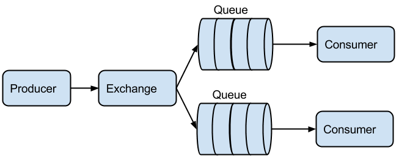

Example Messaging Patterns
==========================

A comprehensive guide to building messaging applications using RabbitMQ and Python. This repository provides practical, example-based tutorials for common messaging patterns.

.. contents:: Table of Contents
   :local:

Installation
------------

Prerequisites:

* Python 3.7+
* RabbitMQ Server

Install dependencies:

.. code-block:: bash

    pip install pika

Quick Start
-----------

1. Start RabbitMQ server
2. Run examples from any pattern directory
3. Each pattern includes producer and consumer scripts

Installation
------------

* Install `RabbitMQ <https://www.rabbitmq.com/download.html>`_
* Install `Pika <https://github.com/pika/pika/>`_

Basic Patterns
--------------

This is a basic pattern for sending messages using RabbitMQ as the broker. The example consists of three components: the **Producer**, **Queue**, and **Consumer**. The producer creates and sends messages to the queue, which resides on the RabbitMQ server. The consumer then retrieves and processes these messages from the queue.

.. image:: ./images/basic.png

Producer
________

A producer is the application that sends the messages. Imagine sending text
messages to your friend.

.. code-block:: python

    #!/usr/bin/env python3
    from queue import Queue

    class Producer(Queue):
        def __init__(self):
            Queue.__init__(self, queue='basic')

    if __name__ == '__main__':
        p = Producer()
        p.send('Basic - Hello World')

.. code-block:: bash

    messaging-patterns/basic$ python producer.py
    0 2014-04-22 00:19:59.497745 - Basic - Hello World sent
    1 2014-04-22 00:19:59.497745 - Basic - Hello World sent
    2 2014-04-22 00:19:59.497745 - Basic - Hello World sent
    3 2014-04-22 00:19:59.497745 - Basic - Hello World sent
    4 2014-04-22 00:19:59.497745 - Basic - Hello World sent

Use the **rabbitmqctl** command line admin tool to list the queues.

.. code-block:: bash

    ~/messaging-patterns/basic$ sudo rabbitmqctl list_queues
    Listing queues ...
    basic	5
    ...done.

Consumer
________

A consumer is the application that receives the messages. Imagine your friend
who is receiving your text messages.

.. code-block:: python

    #!/usr/bin/env python
    from queue import Queue

    class Consumer(Queue):
        def __init__(self):
            Queue.__init__(self, queue='basic')

        def callback(self, ch, method, properties, body):
            print(f'{body} received')

    if __name__ == '__main__':
        p = Consumer()
        p.receive()

The following is the execution and output of the consumer.py script.

.. code-block:: bash

    ~/messaging-patterns/basic$ python consumer.py
    0 2014-04-22 00:19:59.497745 - Basic - Hello World received
    1 2014-04-22 00:19:59.497745 - Basic - Hello World received
    2 2014-04-22 00:19:59.497745 - Basic - Hello World received
    3 2014-04-22 00:19:59.497745 - Basic - Hello World received
    4 2014-04-22 00:19:59.497745 - Basic - Hello World received

Queue
_____

The Queue in this setup is the RabbitMQ server, which communicates using the AMQP protocol. It receives and stores messages, allowing the consumer to pick them up whenever it's ready. Think of it like texting a friend whose phone is off—your messages are held in the Queue until your friend turns their phone back on and receives them.

.. code-block:: python

    #!/usr/bin/env python
    import pika

    class Queue:
        def __init__(self, queue='queue', host='localhost', routing='route'):
            self.connection = pika.BlockingConnection(pika.ConnectionParameters(
            host=host))
            self.channel = self.connection.channel()
            self.channel.queue_declare(queue=queue)
            self.routing = routing
            self.queue = queue

        def send(self, msg):
            self.channel.basic_publish(exchange='', routing_key=self.queue,
                                       body=msg)

        def receive(self):
            self.channel.basic_consume(self.callback, queue=self.queue,
                                       no_ack=True)
            self.channel.start_consuming()

Worker
------

This example demonstrates a work queue, designed to distribute messages across multiple workers. It is the next simplest pattern after a basic messaging setup. Like before, this pattern has three components: the **Producer**, **Queue**, and **Consumers**. The producer creates and sends messages to the queue, which resides on the RabbitMQ server. Multiple consumers can connect to the queue, with messages distributed evenly among them. You can add as many consumers as needed to share the workload.

.. image:: ./images/worker.png

Producer
________

This producer functions just like in the previous basic example. It’s the application responsible for sending messages.

.. code-block:: python

    #!/usr/bin/env python3
    from datetime import datetime
    from queue import Queue

    class Producer(Queue):
        def __init__(self):
            Queue.__init__(self, queue='basic')

    if __name__ == '__main__':
        NOW = datetime.now()
        p = Producer()
        for i in range(15):
            p.send(f'{i} {NOW} - Basic - Hello World')
            print(f'{i} {NOW} - Basic - Hello World sent')
        p.close()

.. code-block:: bash

    ~/messaging-patterns/workers$ python producer.py
    0 2014-04-22 00:10:16.946810 - Basic - Hello World sent
    1 2014-04-22 00:10:16.946810 - Basic - Hello World sent
    2 2014-04-22 00:10:16.946810 - Basic - Hello World sent
    3 2014-04-22 00:10:16.946810 - Basic - Hello World sent
    4 2014-04-22 00:10:16.946810 - Basic - Hello World sent
    5 2014-04-22 00:10:16.946810 - Basic - Hello World sent
    6 2014-04-22 00:10:16.946810 - Basic - Hello World sent
    7 2014-04-22 00:10:16.946810 - Basic - Hello World sent
    8 2014-04-22 00:10:16.946810 - Basic - Hello World sent
    9 2014-04-22 00:10:16.946810 - Basic - Hello World sent
    10 2014-04-22 00:10:16.946810 - Basic - Hello World sent
    11 2014-04-22 00:10:16.946810 - Basic - Hello World sent
    12 2014-04-22 00:10:16.946810 - Basic - Hello World sent
    13 2014-04-22 00:10:16.946810 - Basic - Hello World sent
    14 2014-04-22 00:10:16.946810 - Basic - Hello World sent

Use the **rabbitmqctl** command line admin tool to list the queues.

.. code-block:: bash

    ~/messaging-patterns/workers$ sudo rabbitmqctl list_queues
    Listing queues ...
    basic	15
    ...done.

Consumers
_________

A consumer is the application that receives messages. This consumer retrieves a message, prints it to the terminal, waits for 1 second, and then repeats the process.

.. code-block:: python

    #!/usr/bin/env python3
    import time
    from queue import Queue

    class Consumer(Queue):
        def __init__(self):
            Queue.__init__(self, queue='basic')

        def callback(self, ch, method, properties, body):
            print(f'Received: {body}')
            time.sleep(1)

    if __name__ == '__main__':
        p = Consumer()
        p.receive(p.callback)

Here, I'm running three separate instances of **consumer.py** in different terminal windows. Notice that the numbers at the beginning of each line are unique—each consumer receives a different message from the set sent by the producer. Each consumer processes one message, waits for one second, and then repeats the process.

.. code-block:: bash

    ~/messaging-patterns/workers$ python consumer.py
    0 2014-04-22 00:10:16.946810 - Basic - Hello World received
    3 2014-04-22 00:10:16.946810 - Basic - Hello World received
    6 2014-04-22 00:10:16.946810 - Basic - Hello World received
    9 2014-04-22 00:10:16.946810 - Basic - Hello World received
    12 2014-04-22 00:10:16.946810 - Basic - Hello World received

.. code-block:: bash

    ~/messaging-patterns/workers$ python consumer.py
    1 2014-04-22 00:10:16.946810 - Basic - Hello World received
    4 2014-04-22 00:10:16.946810 - Basic - Hello World received
    7 2014-04-22 00:10:16.946810 - Basic - Hello World received
    10 2014-04-22 00:10:16.946810 - Basic - Hello World received
    13 2014-04-22 00:10:16.946810 - Basic - Hello World received

.. code-block:: bash

    ~/messaging-patterns/workers$ python consumer.py
    2 2014-04-22 00:10:16.946810 - Basic - Hello World received
    5 2014-04-22 00:10:16.946810 - Basic - Hello World received
    8 2014-04-22 00:10:16.946810 - Basic - Hello World received
    11 2014-04-22 00:10:16.946810 - Basic - Hello World received
    14 2014-04-22 00:10:16.946810 - Basic - Hello World received

Queue
______

The Queue in this setup is the RabbitMQ server, which communicates using the AMQP protocol. It receives and stores messages, allowing the consumer to retrieve them when ready. Imagine it like sending a text to a friend whose phone is off—the messages you send are held in the Queue until your friend turns their phone back on to receive them.

.. code-block:: python
    
    #!/usr/bin/env python3
    import pika

    class Queue:
        def __init__(self, queue='queue', host='localhost', routing='route'):
            self.connection = pika.BlockingConnection(pika.ConnectionParameters(
            host=host))
            self.channel = self.connection.channel()
            self.channel.queue_declare(queue=queue)
            self.routing = routing
            self.queue = queue

        def send(self, msg):
            self.channel.basic_publish(exchange='',
                          routing_key=self.queue,
                          body=msg)

        def receive(self, callback):
            self.channel.basic_consume(callback,
                          queue=self.queue,
                          no_ack=True)
            self.channel.start_consuming()

Publish/Subscribe
-----------------

The publish/subscribe pattern enables a message to be delivered to multiple consumers, unlike the worker pattern. Here, the producer sends messages directly to an exchange, which then applies its rules to distribute the messages to multiple consumers.

Producer
________

The producer sends messages to the exchange. Same as in the basic example

.. code-block:: python

    #!/usr/bin/env python3
    from datetime import datetime
    from exchange import Exchange

    class Producer(Exchange):
        def __init__(self):
            Exchange.__init__(self, exchange='exchange-001', type='fanout')

        def send(self, msg):
            self.channel.basic_publish(exchange=self.exchange, routing_key='', body=msg)

    if __name__ == '__main__':
        NOW = datetime.now()
        p = Producer()
        for i in range(5):
            p.send(f'{i} {NOW} - Pub/Sub - Hello World')
            print(f'{i} {NOW} - Pub/Sub - Hello World sent')
        p.close()

.. code-block:: bash

    ~/messaging-patterns/pubsub$ python producer.py
    0 2014-04-22 09:39:16.483488 - Pub/Sub - Hello World sent
    1 2014-04-22 09:39:16.483488 - Pub/Sub - Hello World sent
    2 2014-04-22 09:39:16.483488 - Pub/Sub - Hello World sent
    3 2014-04-22 09:39:16.483488 - Pub/Sub - Hello World sent
    4 2014-04-22 09:39:16.483488 - Pub/Sub - Hello World sent

Use the **rabbitmqctl** command line admin tool to list the queues.

.. code-block:: bash

    ~/messaging-patterns/pubsub$ sudo rabbitmqctl list_queues
    Listing queues ...
    basic	15
    ...done.

Exchange
________

The producer doesn't send messages directly to a queue; instead, it sends them to an exchange. The exchange receives messages from producers and decides how to route them—either by delivering them to one or more queues or by discarding them. This routing behavior depends on the type of exchange. Here are the available exchange types:

The rules, known as the exchange types are:
**direct**, **topic**, **headers** and **fanout**.

.. code-block:: bash

    ~/messaging-patterns/pubsub$ sudo rabbitmqctl list_exchanges
    Listing exchanges ...
        direct
    amq.direct	direct
    amq.fanout	fanout
    amq.headers	headers
    amq.match	headers
    amq.rabbitmq.log	topic
    amq.rabbitmq.trace	topic
    amq.topic	topic
    ...done.

In terms of learning and clarification, I am representing the exchange as a class.

.. code-block:: python

    #!/usr/bin/env python3
    import pika
    from queue import Queue

    class Exchange(Queue):
        def __init__(self, exchange='exchange-001', type='fanout'):
            Queue.__init__(self)
            self.channel.exchange_declare(exchange=exchange, type=type)
            self.exchange = exchange
            self.type = type

Consumers
_________

.. code-block:: python

    #!/usr/bin/env python3
    import time
    from exchange import Exchange

    class Consumer(Exchange):
        def __init__(self):
            Exchange.__init__(self, exchange='exchange-001', type='fanout')
            self.bind()

        def bind(self):
            result = self.channel.queue_declare(exclusive=True)
            self.channel.queue_bind(exchange=self.exchange, queue=result.method.queue)
            self.queue = result.method.queue

        def callback(self, ch, method, properties, body):
            print(f'{body} received')
            #time.sleep(5)

    if __name__ == '__main__':
        p = Consumer()
        p.receive(p.callback)

Here, I'm running three separate instances of **consumer.py** in different terminals. You’ll notice that the numbers at the beginning of each line are unique. Each consumer receives a different message from the set of messages sent by the producer.

.. code-block:: bash

    ~/messaging-patterns/pubsub$ tty
    /dev/pts/7

    ~/messaging-patterns/pubsub$ python consumer.py
    0 2014-04-22 09:39:16.483488 - Pub/Sub - Hello World received
    1 2014-04-22 09:39:16.483488 - Pub/Sub - Hello World received
    2 2014-04-22 09:39:16.483488 - Pub/Sub - Hello World received
    3 2014-04-22 09:39:16.483488 - Pub/Sub - Hello World received
    4 2014-04-22 09:39:16.483488 - Pub/Sub - Hello World received

.. code-block:: bash

    ~/messaging-patterns/pubsub$ tty
    /dev/pts/4

    ~/messaging-patterns/pubsub$ python consumer.py
    0 2014-04-22 09:39:16.483488 - Pub/Sub - Hello World received
    1 2014-04-22 09:39:16.483488 - Pub/Sub - Hello World received
    2 2014-04-22 09:39:16.483488 - Pub/Sub - Hello World received
    3 2014-04-22 09:39:16.483488 - Pub/Sub - Hello World received
    4 2014-04-22 09:39:16.483488 - Pub/Sub - Hello World received

.. code-block:: bash

    ~/messaging-patterns/pubsub$ tty
    /dev/pts/9

    ~/messaging-patterns/pubsub$ python consumer.py
    0 2014-04-22 09:39:16.483488 - Pub/Sub - Hello World received
    1 2014-04-22 09:39:16.483488 - Pub/Sub - Hello World received
    2 2014-04-22 09:39:16.483488 - Pub/Sub - Hello World received
    3 2014-04-22 09:39:16.483488 - Pub/Sub - Hello World received
    4 2014-04-22 09:39:16.483488 - Pub/Sub - Hello World received

Queue
_____

The Queue is the RabbitMQ server, which uses AMQP for communication. It receives and stores messages, allowing the consumer to retrieve them when ready.

.. code-block:: python

    #!/usr/bin/env python3
    import pika

    class Queue:
        def __init__(self, queue='queue', host='localhost', routing='route'):
            self.connection = pika.BlockingConnection(pika.ConnectionParameters(
            host=host))
            self.channel = self.connection.channel()
            self.channel.queue_declare(queue=queue)
            self.routing = routing
            self.queue = queue

        def send(self, msg):
            self.channel.basic_publish(exchange='',
                          routing_key=self.queue,
                          body=msg)

        def receive(self, callback):
            self.channel.basic_consume(callback,
                          queue=self.queue,
                          no_ack=True)
            self.channel.start_consuming()

Routing
-------

This routing pattern uses the **direct** exchange type along with a **routing_key**. Consumers use this key to access the messages from the queue.

.. image:: ./images/routing.png

Producer
________

The producer sends messages to the exchange, which in this case is of the **direct** type. The producer also accepts an argument that is used as the **routing_key**.

.. code-block:: python

    #!/usr/bin/env python3
    import sys
    from datetime import datetime
    from exchange import Exchange

    class Producer(Exchange):
        def __init__(self):
            Exchange.__init__(self, exchange='exchange_001', type='direct')
            self.routing=sys.argv[1]

        def send(self, msg):
            self.channel.basic_publish(exchange=self.exchange,
                                       routing_key=self.routing,
                                       body=msg)

    if __name__ == '__main__':
        NOW = datetime.now()
        p = Producer()
        for i in range(5):
            p.send(f'{i} {NOW} - Routing - {p.routing}')
            print(f'{i} {NOW} - Routing - {p.routing} sent')
        p.close()

Below, you can see that I ran the producer with **blue**, **red**, and then **green** as a single argument. This argument is used as the **routing_key**, which consumers will need to retrieve the corresponding message.

.. code-block:: bash

    ~/messaging-patterns/routing$ python producer.py blue
    0 2014-04-22 12:08:08.657679 - Routing - blue sent
    1 2014-04-22 12:08:08.657679 - Routing - blue sent
    2 2014-04-22 12:08:08.657679 - Routing - blue sent
    3 2014-04-22 12:08:08.657679 - Routing - blue sent
    4 2014-04-22 12:08:08.657679 - Routing - blue sent

.. code-block:: bash

    ~/messaging-patterns/routing$ python producer.py red
    0 2014-04-22 12:08:12.715046 - Routing - red sent
    1 2014-04-22 12:08:12.715046 - Routing - red sent
    2 2014-04-22 12:08:12.715046 - Routing - red sent
    3 2014-04-22 12:08:12.715046 - Routing - red sent
    4 2014-04-22 12:08:12.715046 - Routing - red sent

.. code-block:: bash

    ~/messaging-patterns/routing$ python producer.py green
    0 2014-04-22 12:08:19.934197 - Routing - green sent
    1 2014-04-22 12:08:19.934197 - Routing - green sent
    2 2014-04-22 12:08:19.934197 - Routing - green sent
    3 2014-04-22 12:08:19.934197 - Routing - green sent
    4 2014-04-22 12:08:19.934197 - Routing - green sent

.. code-block:: bash

    ~/messaging-patterns/pubsub$ sudo rabbitmqctl list_bindings
    Listing bindings ...
        exchange	amq.gen-BXvvwbg12wVC3XJsPQPz9A	queue	amq.gen-BXvvwbg12wVC3XJsPQPz9A	[]
        exchange	basic	queue	basic	[]
        exchange	queue	queue	queue	[]
    exchange-001	exchange	amq.gen-BXvvwbg12wVC3XJsPQPz9A	queue	amq.gen-BXvvwbg12wVC3XJsPQPz9A	[]
    ...done.

Exchange
________

The exchange receives messages from the producer and routes them to queues. It determines how to handle each message, with options to send it to a single queue, multiple queues, or discard it entirely. The routing decision depends on the type of exchange.

This example uses the **direct** exchange type. For clarity, I am representing the exchange as a class.

.. code-block:: python

    #!/usr/bin/env python3
    import pika
    from queue import Queue

    class Exchange(Queue):
        def __init__(self, exchange='exchange_001', type='direct'):
            Queue.__init__(self)
            self.channel.exchange_declare(exchange=exchange, type=type)
            self.exchange = exchange
            self.type = type

Consumers
_________

A consumer is the application that receives messages. This consumer accepts one argument, which is used as the **routing_key**. It then prints all messages with that **routing_key** to the terminal.

.. code-block:: python

    #!/usr/bin/env python3
    import sys
    import time
    from exchange import Exchange

    class Consumer(Exchange):
        def __init__(self):
            Exchange.__init__(self, exchange='exchange_001', type='direct')
            self.routing = sys.argv[1]
            self.bind()

        def bind(self):
            result = self.channel.queue_declare(exclusive=True)
            self.channel.queue_bind(exchange=self.exchange, queue=result.method
            .queue, routing_key=self.routing)
            self.queue = result.method.queue

        def callback(self, ch, method, properties, body):
            print(f'{body} received')

    if __name__ == '__main__':
        p = Consumer()
        p.receive()

In these examples, the consumer is provided with an argument that serves as the **routing_key**. It then retrieves the messages associated with that **routing_key**.

.. code-block:: bash

    ~/messaging-patterns/pubsub$ tty
    /dev/pts/3

.. code-block:: bash

    ~/messaging-patterns/routing$ python consumer.py blue
    0 2014-04-22 12:08:08.657679 - Routing - blue received
    1 2014-04-22 12:08:08.657679 - Routing - blue received
    2 2014-04-22 12:08:08.657679 - Routing - blue received
    3 2014-04-22 12:08:08.657679 - Routing - blue received
    4 2014-04-22 12:08:08.657679 - Routing - blue received

.. code-block:: bash

    ~/messaging-patterns/pubsub$ tty
    /dev/pts/4

.. code-block:: bash

    ~/messaging-patterns/routing$ python consumer.py red
    0 2014-04-22 12:08:12.715046 - Routing - red received
    1 2014-04-22 12:08:12.715046 - Routing - red received
    2 2014-04-22 12:08:12.715046 - Routing - red received
    3 2014-04-22 12:08:12.715046 - Routing - red received
    4 2014-04-22 12:08:12.715046 - Routing - red received

.. code-block:: bash

    ~/messaging-patterns/pubsub$ tty
    /dev/pts/5

.. code-block:: bash

    ~/messaging-patterns/routing$ python consumer.py green
    0 2014-04-22 12:08:19.934197 - Routing - green received
    1 2014-04-22 12:08:19.934197 - Routing - green received
    2 2014-04-22 12:08:19.934197 - Routing - green received
    3 2014-04-22 12:08:19.934197 - Routing - green received
    4 2014-04-22 12:08:19.934197 - Routing - green received

Queue
_____

The Queue is the RabbitMQ server, which communicates using AMQP. It receives and stores messages, allowing the consumer to retrieve them when ready.

.. code-block:: python

    #!/usr/bin/env python
    import pika

    class Queue:
        def __init__(self, queue='queue', host='localhost', routing='route'):
            self.connection = pika.BlockingConnection(pika.ConnectionParameters(
            host=host))
            self.channel = self.connection.channel()
            self.channel.queue_declare(queue=queue)
            self.routing = routing
            self.queue = queue

        def send(self, msg):
            self.channel.basic_publish(exchange='',
                          routing_key=self.queue,
                          body=msg)

        def receive(self, callback):
            self.channel.basic_consume(callback,
                          queue=self.queue,
                          no_ack=True)
            self.channel.start_consuming()

Topics
______

.. image:: ./images/topic.png

Advanced Patterns
----------------

RPC (Remote Procedure Call)
^^^^^^^^^^^^^^^^^^^^^^^^^^^

The RPC pattern allows one application to call a function on another application running on a different machine.

.. code-block:: python

    #!/usr/bin/env python3
    import pika
    import uuid

    class FibonacciRpcClient:
        def __init__(self):
            self.connection = pika.BlockingConnection(
                pika.ConnectionParameters(host='localhost'))
            self.channel = self.connection.channel()
            result = self.channel.queue_declare(exclusive=True)
            self.callback_queue = result.method.queue
            self.channel.basic_consume(
                queue=self.callback_queue,
                on_message_callback=self.on_response,
                auto_ack=True)

        def on_response(self, ch, method, props, body):
            if self.corr_id == props.correlation_id:
                self.response = body

        def call(self, n):
            self.response = None
            self.corr_id = str(uuid.uuid4())
            self.channel.basic_publish(
                exchange='',
                routing_key='rpc_queue',
                properties=pika.BasicProperties(
                    reply_to=self.callback_queue,
                    correlation_id=self.corr_id,
                ),
                body=str(n))
            while self.response is None:
                self.connection.process_data_events()
            return int(self.response)

    if __name__ == '__main__':
        fibonacci_rpc = FibonacciRpcClient()
        print(" [x] Requesting fib(30)")
        response = fibonacci_rpc.call(30)
        print(f" [.] Got {response}")

Best Practices
-------------

1. **Error Handling**: Always implement proper error handling for connection failures
2. **Connection Management**: Use connection pooling for production applications
3. **Message Acknowledgment**: Implement proper message acknowledgment for reliable delivery
4. **Queue Durability**: Use durable queues for important messages
5. **Exchange Types**: Choose the right exchange type for your use case

Troubleshooting
--------------

Common Issues:

1. **Connection Refused**: Ensure RabbitMQ server is running
2. **Queue Not Found**: Declare queues before using them
3. **Permission Denied**: Check RabbitMQ user permissions
4. **Memory Issues**: Monitor RabbitMQ memory usage

Useful Commands:

.. code-block:: bash

    # Start RabbitMQ
    sudo systemctl start rabbitmq-server
    
    # Check status
    sudo systemctl status rabbitmq-server
    
    # List queues
    sudo rabbitmqctl list_queues
    
    # List exchanges
    sudo rabbitmqctl list_exchanges
    
    # List bindings
    sudo rabbitmqctl list_bindings

Contributing
-----------

Contributions are welcome! Please feel free to submit a Pull Request.

License
-------

This project is licensed under the MIT License - see the LICENSE file for details.
