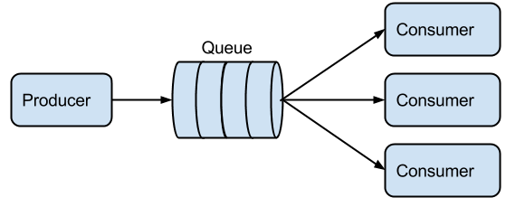

Example Messaging Patterns
=========================

Simple messaging patterns using AMQP/RabbitMQ. This is just a walk through
of a few messaging patterns implemented in python and using RabbitMQ as the
broker.

Requirements
-----------

    * Install `RabbitMQ <https://www.rabbitmq.com/download.html>`_
    * Install `Pika <https://github.com/pika/pika/>`_

Patterns
-----------

Basic
______

.. image:: ./images/basic.png
    :width: 200px
    :align: center
    :height: 100px
    :alt: alternate text

Worker
______

Publish/Subscribe
_________________

.. image:: ./images/pubsub.png

Routing
________

.. image:: ./images/routing.png

Topic
_____

.. image:: ./images/topic.png

RPC
_____

.. image:: ./images/rpc.png

ToDo
----

