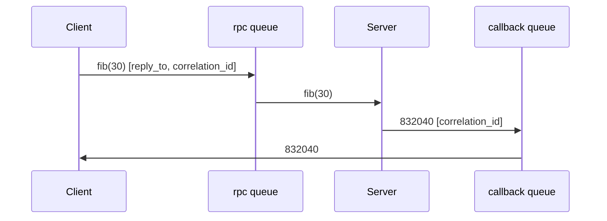

# Remote Procedure Call (RPC)

The RPC pattern uses messaging to run a function on a remote server and wait
for the result. The client publishes a request with two properties:
`reply_to`, an exclusive callback queue where it expects the answer, and
`correlation_id`, a unique id used to match the response to the request. The
server processes the request and publishes the result back to the `reply_to`
queue with the same `correlation_id`.



## Usage

Start the server, which computes Fibonacci numbers:

```bash
python server.py
```

Then request a computation from a client:

```bash
python client.py 30
```
