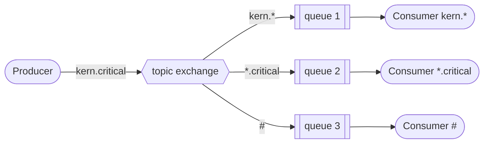

# Topics

The topic pattern uses a **topic** exchange to route messages to queues based
on wildcard matches between the routing key and the patterns used to bind the
queues. Routing keys are dot-separated words (`kern.critical`, `app.info`),
and consumers bind with patterns where `*` matches exactly one word and `#`
matches zero or more words.



## Usage

Start one or more consumers, each with the binding patterns it cares about:

```bash
python consumer.py "kern.*"
python consumer.py "*.critical" "*.error"
python consumer.py "#"
```

Then publish messages with a topic as the routing key:

```bash
python producer.py kern.critical
python producer.py app.info
```
